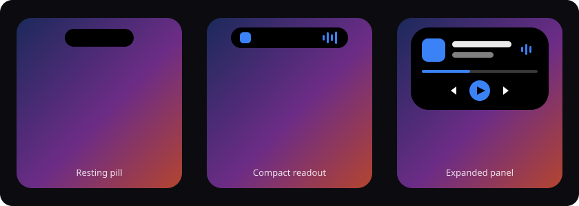

# Notch Island

An iOS-style Dynamic Island for Android. A floating pill sits near the camera cutout and morphs
into whatever the phone is doing right now — music, notifications, charging, volume, timers —
then settles back down.



## What it does

**Four sizes, one tap apart.** The island rests as a bare pill, opens to a compact preview, then
to a small card, then to the full panel — one tap per step, and one more to put it away. Swipe
down to skip the steps and open everything at once. If you would rather a tap just opened it,
*Gestures → Tap behaviour → Open everything at once* does that. Sizes, corners, colour and motion
are all yours to set.

**An iOS replica, if you want one.** *Look → Shape → Preset* carries the real housing
measurements for the iPhone 14/15 Pro, both Pro Max sizes and the 16 Pro pair — 126 × 37 pt at
11 pt from the top edge, and so on. Picking an Apple preset also switches on **iOS mode**: pure
black, fully rounded, a 44 dp corner when open, an optional camera lens drawn inside the pill,
and the same damped-spring motion the real thing uses. That last part is not an ease curve
pretending — `SpringInterpolator` implements SwiftUI's `spring(response:dampingFraction:)`
response, so it overshoots and settles the way the Dynamic Island does.

**Two anchors.** *Below the status bar* makes every pixel tappable. *Over the status bar* draws
the island up at the camera cutout for the real notch look and hangs a transparent strip beneath
it to catch the taps the status bar would otherwise eat — see
[Where the island sits](#where-the-island-sits).

**Material You.** The accent and the island body can each follow your wallpaper, and the colour
pickers lead with wallpaper swatches before the fixed presets. The accent can instead follow the
album art of whatever is playing, or just be a colour you pick.

**Live activities, by priority.** Several things can be live at once, so the island runs a
priority queue and shows the winner:

| Activity | Priority | Lives for |
| --- | --- | --- |
| Call | highest | until the call ends |
| Notification preview | | 1.5–12 s (configurable) |
| Unlock confirmation | | 1.4 s |
| Privacy indicator (mic / camera) | | while the sensor is live |
| Volume change | | 1.6 s |
| Ringer mode change | | 1.5 s |
| Low battery warning | | 5 s |
| Charging / unplugged | | 4.5 s |
| Stopwatch | | until reset |
| Timer countdown | | until it finishes |
| Ongoing activity (navigation, download, delivery) | | until its notification goes |
| Now playing | lowest | while a media session exists |

The ordering rules live in `ActivityQueue`, which has no Android dependencies and is covered by
unit tests — the "sticky activity resurfaces once the transient one expires" behaviour is a test,
not a hope.

Transient activities fade back to whatever sticky activity is underneath — pause a song mid-way
through a notification and the island returns to the now-playing readout, not to nothing.

**Now playing.** Album art on the left, dancing waveform on the right. Expand for a scrubbable
progress bar, previous / play / next, and a media volume slider. With the accent set to *Match
what's playing*, the colour is pulled out of the album art with Palette.

**Notifications, handled rather than just shown.** App icon, title preview and — when expanded —
the body, the notification's own action buttons, Open and Dismiss. On top of that:

- **Quick reply.** Messaging notifications that carry a `RemoteInput` get a reply box in the
  island. The overlay is normally unfocusable so it never steals input; focus is granted only
  while the field is in use, and the back key hands it back.
- **Passcodes.** A one-time code in the text becomes a single *Copy 482915* button. Detection is
  deliberately conservative — a bare number needs verification wording around it — and is unit
  tested against both the codes it should find and the order numbers it should not.
- **Calls.** A call notification takes the island and keeps it, showing the caller and relaying
  the app's own answer and hang-up actions, tinted green and red.
- **Ongoing activities.** Navigation, downloads, deliveries and recordings stay in the island
  with a live progress bar instead of flashing past.
- **Recent.** The last dozen notifications are kept for a history panel you can pull back up.
- **Per-app rules.** Block an app entirely, or mark it to expand the island on arrival.

**Quick panel.** Expanding the idle island gives you a clock, date, brightness and volume
sliders, and round toggles for flashlight, Wi-Fi, Bluetooth, Do Not Disturb, ringer mode,
auto-rotate and app settings. Toggles that Android reserves for the system open the matching
settings panel instead of failing silently.

**Timers and a stopwatch.** A countdown with a progress ring and pause / +1 min / cancel, and a
stopwatch with laps. Both live in the island until they are done.

**Quiet hours and rest.** The island can step aside for a stretch of the day (the window wraps
over midnight correctly — also unit tested), and stops watching media and sensors while the
screen is off.

**Gestures.** Tap, double tap, long press and all four swipes are individually remappable to
twelve actions (expand, collapse, play/pause, next, previous, flashlight, cycle ringer, open the
app, open the last notification, show the quick panel, hide for 30 seconds, or nothing).

## The app

Four tabs plus two sub-screens, all Material 3 Compose:

- **Island** — master switch, a live interactive preview of the three states, a permission
  checklist with one-tap grant buttons, and test actions.
- **Activities** — a switch per live activity, notification preview style and duration, blocked
  apps, and behaviour (always-on pill, hide in landscape, lock screen, dim when expanded, start
  on boot).
- **Look** — device preset and iOS mode, anchor and touch strip, resting/compact/expanded widths, height, corner radius, X/Y
  offset, colour sources (wallpaper / album art / manual) with wallpaper-first swatches, opacity,
  outline, shadow, animation speed, app theme.
- **Gestures** — tap behaviour (step or straight open), the seven gesture mappings, haptics and
  strength, auto-collapse delay.
- **Blocked apps** — searchable list of launchable apps.
- **About** — how priority works, why nothing can draw above the status bar, battery
  optimisation, privacy, and **export / restore** of every setting as a JSON file.

Beyond the app itself: a **quick settings tile** toggles the island from the shade, and
**launcher shortcuts** (long-press the icon) cover toggle, a 5-minute timer, the stopwatch and
recents. *Look → Size → Fit to my camera cutout* measures the real `DisplayCutout` and shapes the
island to the hardware it is imitating.

Every setting is stored in DataStore and collected by both the app and the overlay service, so
changes land on screen as you drag the slider.

## Where the island sits

Android layers windows by type, and an app overlay — the only kind an app without system
privileges can create — is **always placed below the status bar**. The status bar consumes every
touch inside its own band. No permission, flag or window type changes that. This is why the first
build looked fine and ignored every tap: the whole island was inside the dead band.

There are two honest ways to live with that, and *Look → Position → Anchor* picks between them:

| Anchor | Looks like | Touch |
| --- | --- | --- |
| **Below the status bar** (default) | a pill hanging just under the bar | the whole island |
| **Over the status bar** | drawn at the cutout, like hardware | a transparent strip below it |
| **Custom offset** | wherever you put it | only what falls below the bar |

In overlap mode the island is drawn up at the cutout and the window keeps a transparent strip
hanging below the status bar — inside the same window, so it costs no extra surface — and every
touch that lands there is forwarded to the island. A faint handle marks the spot; the strip's
height is a slider. Centre the island and the system clock and icons sit either side of it rather
than drawing through it. Once the island expands it grows well past the bar, so the whole panel
takes touches normally.

The strip is the one trade-off: a small band of screen just under the status bar, as wide as the
strip, belongs to the island rather than the app behind it. Shrink it to taste, or use the default
anchor and give up the cutout look.

Anything that genuinely draws *above* the status bar is a system app, a launcher, or a build with
elevated privileges.

## Permissions

| Permission | Needed for | Required |
| --- | --- | --- |
| Display over other apps | drawing the island at all | yes |
| Notification access | media sessions, notification previews | for those features |
| Modify system settings | brightness and auto-rotate toggles | optional |
| Do Not Disturb access | the DND toggle | optional |
| Post notifications | the ongoing service notification | Android 13+ |

Nothing leaves the device. Notification content is rendered straight into the overlay and is
never stored, logged or uploaded.

## Install

Download **`apks/NotchIsland-release.apk`** and install it. Open the app, grant *Display over
other apps*, and flip the master switch.

`apks/NotchIsland-debug.apk` is the debuggable build. It installs alongside the release one
under a separate package id (`…notchisland.debug`), which is handy for development and useless
otherwise.

Minimum Android 8.0 (API 26), targets Android 14 (API 34).

## Updating

The app updates itself. On launch it quietly checks
[`update.json`](https://github.com/Fizghin/Joyboard/blob/notch/update.json) at the repository
root, and when a newer `versionCode` is published it raises a dialog with the release notes and
a single **Update** button. That downloads the APK matching your build type, shows the progress
in the dialog, and hands the file to Android's installer — no browser, no file manager, no
sideloading dance. *Island → Updates* has a **Check** button and a switch to turn the automatic
check off; *About* has the same button.

Two one-time hurdles the first time you update:

- Android asks you to allow Notch Island to install apps. The dialog sends you straight to that
  setting; come back and tap **Try again**.
- If you are coming from 1.0, install 1.1 by hand — 1.0 shipped before the updater existed, and
  1.0's release APK was unsigned. From 1.1 onward it is all in-app.

**This repository is private, so the default source will not work as-is.** A phone has no
credentials for `raw.githubusercontent.com`, so it gets a 404. Pick one:

- make the repository public — the default URL then works with no further changes; or
- put `update.json` and the two APKs anywhere public (a gist, a release asset, any static host)
  and paste that manifest's address into *Island → Updates → Update source*.

Releases are signed with the committed key in `keystore/notchisland.jks` so each update installs
over the last one. That key is a distribution convenience for these APKs, not a secret — if you
fork this project, generate your own and point the update source at your own manifest.

To publish an update: bump `versionCode`/`versionName` in `app/build.gradle`, build, copy the
APKs into `apks/`, and update `update.json` with the new version, notes and file sizes. The
manifest is small enough to write by hand:

```json
{
  "versionCode": 3,
  "versionName": "1.2",
  "mandatory": false,
  "notes": ["What changed"],
  "releaseApkUrl": "https://…/NotchIsland-release.apk",
  "debugApkUrl": "https://…/NotchIsland-debug.apk",
  "sizeBytes": 12527132,
  "debugSizeBytes": 18861263
}
```

## Build from source

```bash
export ANDROID_HOME=/path/to/android-sdk    # needs platform 34 + build-tools 34.0.0
cd NotchIsland
gradle testDebugUnitTest      # the pure-logic suite
gradle assembleDebug          # or: gradle assembleRelease
```

Output lands in `app/build/outputs/apk/`. `./publish.sh` does the whole release chore: runs the
tests, builds both APKs, copies them into `apks/` and rewrites `update.json` with the new version
and file sizes. CI (`.github/workflows/notchisland.yml`) runs the tests, lint and both builds on
every push to `notch`.

### Tests

The parts that can be tested without a device are pulled out and tested: the live-activity
priority queue, passcode detection, duration formatting, quiet-hour windows that wrap midnight,
and the settings backup round trip including forward compatibility with unknown enum values.
Everything else — window layering, gestures, the overlay itself — needs a real device.

## How it is put together

```
NotchIsland/app/src/main/java/com/joyboard/notchisland/
├── data/            IslandSettings + DataStore repository
├── island/
│   ├── IslandController.kt   overlay window, all the wiring
│   ├── ActivityQueue.kt      priority ordering and expiry (tested)
│   ├── OtpExtractor.kt       passcode detection (tested)
│   ├── StopwatchEngine.kt    laps and elapsed time
│   ├── IslandView.kt         the morphing view: three modes, gestures, panels
│   ├── MediaMonitor.kt       MediaSessionManager + Palette accent extraction
│   ├── SystemMonitors.kt     battery, volume, ringer, screen, mic/camera
│   ├── QuickActions.kt       torch, DND, rotation, brightness, settings panels
│   ├── TimerEngine.kt        countdown live activity
│   ├── WaveformView.kt       the dancing bars
│   └── RingProgressView.kt   charging and timer rings
├── service/
│   ├── NotchOverlayService.kt     foreground service that hosts the overlay
│   ├── NotchNotificationListener.kt
│   ├── IslandTileService.kt       the quick settings tile
│   ├── IslandBus.kt               listener → controller hand-off
│   └── BootReceiver.kt
├── update/          manifest check, APK download, installer hand-off
└── ui/              Compose app: theme, view model, components, six screens
```

The overlay is a `TYPE_APPLICATION_OVERLAY` window with `WRAP_CONTENT` bounds, so it only
consumes touches where the island actually is — the rest of the screen keeps working normally.
The window grows and shrinks with the island because the view animates its own layout params.

A few things are done deliberately to keep it cheap. The expanded panel carries a content
signature and is only rebuilt when that changes, so a volume blip or a timer tick never
reconstructs a seek bar; its measured height is cached against the same signature. The window's
layout params are diffed before `updateViewLayout`, because that call relayouts the whole window.
The touch strip is sized from the resting pill rather than the live height, so expanding never
resizes the window twice. The waveform stops animating the moment it is not visible, and the
progress rings skip no-op updates instead of starting an animator each time.

## Known limits

- App overlays cannot be drawn above the status bar; see
  [Where the island sits](#where-the-island-sits) for what that means and how overlap mode works
  around it.
- Material You colours need Android 12 or newer. Below that the pickers fall back to fixed
  presets and *Match my wallpaper* resolves to a sensible default.
- Wi-Fi and Bluetooth cannot be toggled silently by a normal app on Android 10+; those buttons
  open the system panel.
- Quick reply only appears for notifications whose app ships a free-form `RemoteInput`. Apps that
  only offer "open to reply" cannot be replied to from anywhere but their own UI.
- Answering a call means firing the notification's own action. An app that does not publish one
  can only be opened, not answered.
- There is no per-app *hiding by foreground app* — that needs an accessibility service, which is
  a heavier permission than this app currently asks for.
- Brightness and auto-rotate need *Modify system settings*, which Android grants per app.
- Aggressive battery managers on some OEM skins can stop the overlay service; exclude the app
  from battery optimisation (there is a button in About).
