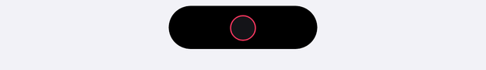
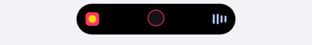
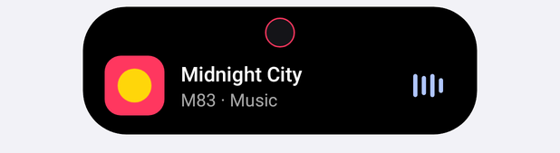
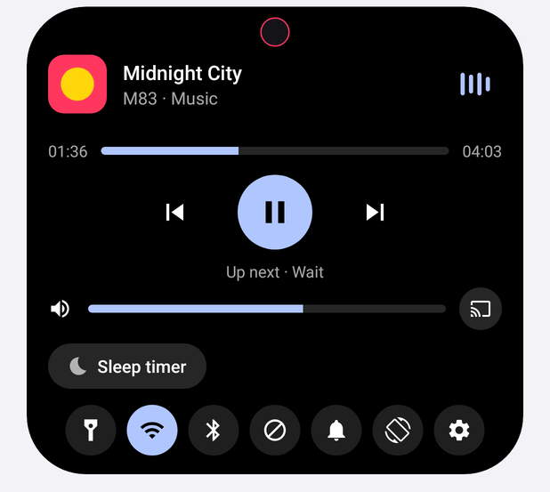
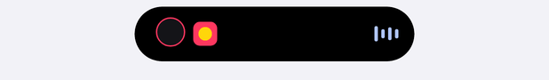
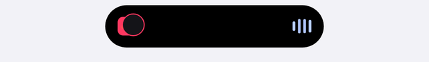

# Notch Island

An iOS-style Dynamic Island for Android. A floating pill sits near the camera cutout and morphs
into whatever the phone is doing right now — music, notifications, charging, volume, timers —
then settles back down.

| Resting | Compact | Small card |
| --- | --- | --- |
|  |  |  |



These are real renders of `IslandView`, drawn by Robolectric with native graphics — not mockups.
The dark circle with a red rim is where the phone's camera sits.

## What it does

**Four sizes, one tap apart.** The island rests as a bare pill, opens to a compact preview, then
to a small card, then to the full panel — one tap per step, and one more to put it away. Swipe
down to skip the steps and open everything at once. If you would rather a tap just opened it,
*Gestures → Tap behaviour → Open everything at once* does that. Sizes, corners, colour and motion
are all yours to set.

**The camera is hardware, and treated as such.** The punch hole is stored against the *screen*,
not the island, so it stays put while the island moves, grows and animates around it. In every
size the island's content is laid out clear of it: an icon that would sit under the lens moves
past it, and the open panel starts below it.

| Content kept clear | Content ignoring the camera |
| --- | --- |
|  |  |

*Detect from this phone* reads the cutout from Android itself — on Android 12 and later, its exact
outline — so it is right for any phone, listed or not. There are also presets for Pixel 6 and the
rest of the Pixel 4a-9 range, Galaxy S23 FE and the S21-S25 and A52-A55 lines, Honor X9b 5G,
OnePlus 9-12, Nothing Phone (1), (2) and (2a), and more, matched automatically from the phone's
model. Picking one sets the island's whole shape, not just the camera: the resting pill's width
and height, the corner, the offsets, and the compact, small-card and open widths — scaled from the
iPhone 14 Pro's proportions to that camera and your screen (a Pixel 6 comes out at 122 × 36 dp,
206 compact, 388 open). Presets know *where* each camera is; the camera sizes are close starting
points, and the app says so. A camera near the middle gets the island wrapped around it; one in a
corner leaves the island centred on the same row.

**Shaped to your phone, not a guess.** *Look → Shape → Calibrate to my punch hole* opens a
full-screen aligner that draws into the cutout area with the system bars hidden. Drag the pill
straight onto your real camera — centred, left, right, wherever the maker put it — size it with
sliders, and place the stand-in lens to match. What you see there is what the overlay does.

**An iOS replica, if you want one.** *Look → Shape → Preset* carries the real housing
measurements for the iPhone 14/15 Pro, both Pro Max sizes and the 16 Pro pair — 126 × 37 pt at
11 pt from the top edge, and so on. Picking an Apple preset also switches on **iOS mode**: pure
black, fully rounded, a 44 dp corner when open, an optional camera lens drawn inside the pill,
and the same damped-spring motion the real thing uses. That last part is not an ease curve
pretending — `SpringInterpolator` implements SwiftUI's `spring(response:dampingFraction:)`
response, so it overshoots and settles the way the Dynamic Island does.

**Two anchors.** *Below the status bar* makes every pixel tappable. *Over the status bar* draws
the island up at the camera cutout for the real notch look and hangs a transparent strip beneath
it to catch the taps the status bar would otherwise eat — see
[Where the island sits](#where-the-island-sits).

**Material You.** The accent and the island body can each follow your wallpaper, and the colour
pickers lead with wallpaper swatches before the fixed presets. The accent can instead follow the
album art of whatever is playing, or just be a colour you pick.

**Live activities, by priority.** Several things can be live at once, so the island runs a
priority queue and shows the winner:

| Activity | Priority | Lives for |
| --- | --- | --- |
| Call | highest | until the call ends |
| Notification preview | | 1.5–12 s (configurable) |
| Automation message | | 1–600 s, as sent |
| Unlock confirmation | | 1.4 s |
| Privacy indicator (mic / camera) | | while the sensor is live |
| Volume change | | 1.6 s |
| Ringer mode change | | 1.5 s |
| Low battery warning | | 5 s |
| Charging / unplugged | | 4.5 s |
| Stopwatch | | until reset |
| Timer countdown | | until it finishes |
| Ongoing activity (navigation, download, delivery) | | until its notification goes |
| Next calendar event | | from the lead time until 5 min in |
| Now playing | lowest | while a media session exists |

The ordering rules live in `ActivityQueue`, which has no Android dependencies and is covered by
unit tests — the "sticky activity resurfaces once the transient one expires" behaviour is a test,
not a hope.

Transient activities fade back to whatever sticky activity is underneath — pause a song mid-way
through a notification and the island returns to the now-playing readout, not to nothing.

**Now playing.** Album art on the left, dancing waveform on the right. Expand for a scrubbable
progress bar, previous / play / next, what is *up next* (when the player publishes its queue), a
media volume slider, and an output button beside it — like AirPlay's — that opens the system's
picker for where the sound goes. With the accent set to *Match what's playing*, the colour is
pulled out of the album art with Palette.

**Lyrics, if you want them.** Switch on *Synced lyrics* and the open media panel shows the line
being sung and the next one, in time with the playhead. They come from
[LRCLIB](https://lrclib.net), a free public lyrics database; only the song's title, artist, album
and length are sent, each song is looked up once, and it is off until you turn it on.

**Weather.** Switch on *Weather* and the quick panel shows the conditions beside the date, with
a short *Rain soon* heads-up when a dry spell is due to turn wet within the hour. Forecasts come
from [Open-Meteo](https://open-meteo.com), which needs no account. The app asks for approximate
location once, rounds it to about 10 km before storing it, and only updates it while the app
itself is open — the island never uses location in the background. Off until you turn it on.

**Your next meeting.** Switch on *Next calendar event* and the island counts down to it — "12m" in
the pill, the time and place when opened, the event itself on a tap. It comes up once when the
event enters its window (5–60 minutes ahead, your choice) and again when it starts. All-day,
cancelled and declined events are left alone. Off until you turn it on, since it needs calendar
access.

**Staying out of the way.** The island steps aside when a video or game goes full screen — it
watches the status bar through its own window insets, so that needs no permission — and comes
straight back when the bar does. A call still breaks through. The sideloaded build can also hide
in apps you pick and while a keyboard is open, through an optional helper described under
[Permissions](#permissions).

**Automation.** Tasker, Automate, MacroDroid or a shortcut can put their own messages on the
island — see [Automation](#automation). Off unless you switch it on.

**Notifications, handled rather than just shown.** App icon, title preview and — when expanded —
the body, the notification's own action buttons, Open and Dismiss. On top of that:

- **Quick reply.** Messaging notifications that carry a `RemoteInput` get a reply box in the
  island. The overlay is normally unfocusable so it never steals input; focus is granted only
  while the field is in use, and the back key hands it back.
- **Passcodes.** A one-time code in the text becomes a single *Copy 482915* button. Detection is
  deliberately conservative — a bare number needs verification wording around it — and is unit
  tested against both the codes it should find and the order numbers it should not.
- **Calls.** A call notification takes the island and keeps it, showing the caller and relaying
  the app's own answer and hang-up actions, tinted green and red.
- **Ongoing activities.** Navigation, downloads, deliveries and recordings stay in the island
  with a live progress bar instead of flashing past.
- **Recent.** The last dozen notifications are kept for a history panel you can pull back up.
- **Per-app rules.** Block an app entirely, mark it to expand the island on arrival, or (with the
  helper) keep the island hidden while that app is open.

**Quick panel.** Expanding the idle island gives you a clock, date, brightness and volume
sliders, and round toggles for flashlight, Wi-Fi, Bluetooth, Do Not Disturb, ringer mode,
auto-rotate and app settings. Toggles that Android reserves for the system open the matching
settings panel instead of failing silently.

**Timers and a stopwatch.** A countdown with a progress ring and pause / +1 min / cancel, and a
stopwatch with laps. Both live in the island until they are done.

**Quiet hours and rest.** The island can step aside for a stretch of the day (the window wraps
over midnight correctly — also unit tested), and stops watching media and sensors while the
screen is off.

**Gestures.** Tap, double tap, long press and all four swipes are individually remappable to
twelve actions (expand, collapse, play/pause, next, previous, flashlight, cycle ringer, open the
app, open the last notification, show the quick panel, hide for 30 seconds, or nothing).

## The app

Four tabs plus two sub-screens, all Material 3 Compose:

- **Island** — master switch, a live interactive preview of the three states, a permission
  checklist with one-tap grant buttons, and test actions.
- **Activities** — a switch per live activity, notification preview style and duration, per-app
  rules, behaviour (always-on pill, hide in landscape, hide in full screen, hide while typing,
  lock screen, dim when expanded, start on boot) and automation.
- **Look** — device preset and iOS mode, anchor and touch strip, resting/compact/expanded widths, height, corner radius, X/Y
  offset, colour sources (wallpaper / album art / manual) with wallpaper-first swatches, opacity,
  outline, shadow, animation speed, app theme.
- **Gestures** — tap behaviour (step or straight open), the seven gesture mappings, haptics and
  strength, auto-collapse delay.
- **Per-app rules** — searchable list of launchable apps, with Block, Open and (sideload) Hide.
- **About** — how priority works, why nothing can draw above the status bar, battery
  optimisation, privacy, and **export / restore** of every setting as a JSON file.

Beyond the app itself: a **quick settings tile** toggles the island from the shade, and
**launcher shortcuts** (long-press the icon) cover toggle, a 5-minute timer, the stopwatch and
recents. *Look → Size → Fit to my camera cutout* measures the real `DisplayCutout` and shapes the
island to the hardware it is imitating.

Every setting is stored in DataStore and collected by both the app and the overlay service, so
changes land on screen as you drag the slider.

## Where the island sits

Android layers windows by type, and an ordinary app overlay is **always placed below the status
bar**. Two things follow: notification and system icons are drawn *across* the island wherever it
reaches into the bar, and the status bar consumes every touch inside its own band. This is why the
first build looked fine and ignored every tap: the whole island was inside the dead band.

**The fix: draw above it.** The one window an app can place above the status bar is an
*accessibility overlay*. In the sideloaded build, turn on the helper (*Island → Permissions →
Helper service*) and, with *Look → Position → Draw above the status bar* on — the default — the
island moves into one: icons go *under* the island instead of across it, every part of it takes
taps, and the touch strip below is no longer needed. Because that window is also above the
notification shade, the island steps aside while the shade is pulled down. The Play build cannot
do this: Play reserves accessibility services for disability tools.

Without the helper there are two honest ways to live with the status bar, and *Look → Position →
Anchor* picks between them:

| Anchor | Looks like | Touch |
| --- | --- | --- |
| **Below the status bar** (default) | a pill hanging just under the bar | the whole island |
| **Over the status bar** | drawn at the cutout, like hardware | a transparent strip below it |
| **Custom offset** | wherever you put it | only what falls below the bar |

In overlap mode the island is drawn up at the cutout and the window keeps a transparent strip
hanging below the status bar — inside the same window, so it costs no extra surface — and every
touch that lands there is forwarded to the island. A faint handle marks the spot; the strip's
height is a slider. Centre the island and the system clock and icons sit either side of it rather
than drawing through it. Once the island expands it grows well past the bar, so the whole panel
takes touches normally.

The strip is one trade-off: a small band of screen just under the status bar, as wide as the strip,
belongs to the island rather than the app behind it. The other is the icons — without the helper,
notification icons are drawn over the part of the island inside the bar. Shrink the pill to fit
between them, turn on the helper, or use the default anchor and give up the cutout look.

## Permissions

| Permission | Needed for | Required |
| --- | --- | --- |
| Display over other apps | drawing the island at all | yes |
| Notification access | media sessions, notification previews | for those features |
| Modify system settings | brightness and auto-rotate toggles | optional |
| Do Not Disturb access | the DND toggle | optional |
| Read calendar | the next-event countdown | only if you switch it on |
| Approximate location | the weather's area, taken while the app is open | only if you switch it on |
| Helper accessibility service | drawing above the status bar; hiding in chosen apps and while typing | sideload build, optional |
| Post notifications | the ongoing service notification | Android 13+ |

Notification content is rendered straight into the overlay and is never stored, logged or
uploaded. Nothing leaves the device unless you switch on lyrics (the song's title, artist, album
and length go to LRCLIB) or weather (your area, rounded to about 10 km, goes to Open-Meteo) —
plus the sideload build's update check, which sends nothing but the request.

**About the helper.** Two things need an accessibility service: drawing the island *above* the
status bar (see [Where the island sits](#where-the-island-sits)), and knowing which app is in front
and whether a keyboard or the shade is open, for hiding. The helper asks for window changes and
nothing else: it never reads a view or any text, and it stores and sends nothing. The app explains
this before sending you to the setting. It is only in the sideloaded build, because Google Play
reserves accessibility services for tools that help people with disabilities. Full-screen hiding
does not need it.

On Android 13 and later, a sideloaded app's accessibility service is a *restricted setting*: the
switch is greyed out until you allow it. Open *App info* (the helper dialog has a button), tap
**⋮ → Allow restricted settings**, then switch the helper on.

## Automation

Off by default. Switch on *Activities → Automation → Let other apps post to the island*, and while
the island is running it listens for two broadcasts:

| Action | Extras |
| --- | --- |
| `com.joyboard.notchisland.action.SHOW` | `title` (required), `text`, `duration` in seconds (default 5, 1–600), `color` as `#RRGGBB`, `icon`, `expand` (`true` to open it) |
| `com.joyboard.notchisland.action.DISMISS` | none |

`icon` is one of `bell`, `timer`, `music`, `calendar`, `battery`, `wifi`, `bluetooth`, `torch` or
`island`. Numbers and flags may be sent as text, which is how Tasker sends them. Titles are cut
at 80 characters and text at 240.

In Tasker: *System → Send Intent*, Action `com.joyboard.notchisland.action.SHOW`, Extra
`title:Laundry done`, another `duration:10`, Target *Broadcast Receiver*. From a shell:

```bash
adb shell am broadcast -a com.joyboard.notchisland.action.SHOW \
  --es title "Laundry done" --es text "Drum's stopped" --ei duration 10 --es color "#34C759"
```

Messages are text only and carry no tap target: another app can make the island say something,
but never make it open anything. Nothing is registered while the setting is off. The settings
screen has a button that sends a test message.

Launcher shortcuts cover the rest — a 5-minute timer, the stopwatch, recent notifications.

## Builds

| Flavour | Who it is for | Updater | Size |
| --- | --- | --- | --- |
| `sideload` | downloaded from here | yes, in-app | ~2 MB release |
| `play` | the Play Store | no — Play forbids the permission | ~2 MB |

The sideload build also carries the optional helper service; the Play build has neither.

The release build runs R8 with resource shrinking, which takes it from 12.6 MB to under 2 MB. The
app's own classes are deliberately kept whole: nearly all the shrinking comes from dead library
code, so keeping them costs about 65 kB and removes a whole class of release-only crash, while
leaving stack traces readable.

```bash
./gradlew assembleSideloadRelease  # the APK published here
./gradlew bundlePlayRelease        # the AAB for the Play Store
./publish.sh                       # tests, lint, every artifact, and update.json
```

Both carry a startup profile (`app/src/main/baseline-prof.txt`) compiled ahead of time, which
`profileinstaller` applies to sideloaded installs too, so the first taps after an install are not
spent in the interpreter.

## Install

Download **`apks/NotchIsland-release.apk`** and install it. Open the app, grant *Display over
other apps*, and flip the master switch.

`apks/NotchIsland-debug.apk` is the debuggable build. It installs alongside the release one
under a separate package id (`…notchisland.debug`), which is handy for development and useless
otherwise.

Minimum Android 8.0 (API 26), targets Android 16 (API 36).

## Updating

The app updates itself. On launch it quietly checks
[`update.json`](https://github.com/Fizghin/Joyboard/blob/notch/update.json) at the repository
root, and when a newer `versionCode` is published it raises a dialog with the release notes and
a single **Update** button. That downloads the APK matching your build type, shows the progress
in the dialog, and hands the file to Android's installer — no browser, no file manager, no
sideloading dance. *Island → Updates* has a **Check** button and a switch to turn the automatic
check off; *About* has the same button.

Two one-time hurdles the first time you update:

- Android asks you to allow Notch Island to install apps. The dialog sends you straight to that
  setting; come back and tap **Try again**.
- If you are coming from 1.0, install 1.1 by hand — 1.0 shipped before the updater existed, and
  1.0's release APK was unsigned. From 1.1 onward it is all in-app.

**This repository is private, so the default source will not work as-is.** A phone has no
credentials for `raw.githubusercontent.com`, so it gets a 404. Pick one:

- make the repository public — the default URL then works with no further changes; or
- put `update.json` and the two APKs anywhere public (a gist, a release asset, any static host)
  and paste that manifest's address into *Island → Updates → Update source*.

Releases are signed with the committed key in `keystore/notchisland.jks` so each update installs
over the last one. That key is a distribution convenience for these APKs, not a secret — if you
fork this project, generate your own and point the update source at your own manifest.

To publish an update: bump `versionCode`/`versionName` in `app/build.gradle`, build, copy the
APKs into `apks/`, and update `update.json` with the new version, notes and file sizes. The
manifest is small enough to write by hand:

```json
{
  "versionCode": 3,
  "versionName": "1.2",
  "mandatory": false,
  "notes": ["What changed"],
  "releaseApkUrl": "https://…/NotchIsland-release.apk",
  "debugApkUrl": "https://…/NotchIsland-debug.apk",
  "sizeBytes": 12527132,
  "debugSizeBytes": 18861263
}
```

## Build from source

```bash
export ANDROID_HOME=/path/to/android-sdk    # needs platforms 36 and 37, build-tools 37
cd NotchIsland
./gradlew testSideloadDebugUnitTest   # the whole suite, JVM and Robolectric
./gradlew assembleSideloadDebug       # or assembleSideloadRelease, bundlePlayRelease
```

JDK 17 or newer; the builds here are verified with 21.

Output lands in `app/build/outputs/apk/`. `./publish.sh` does the whole release chore: runs the
tests, builds both APKs, copies them into `apks/` and rewrites `update.json` with the new version
and file sizes. CI (`.github/workflows/notchisland.yml`) runs the tests, lint and both builds on
every push to `notch`.

### Tests

163 tests in two layers.

**Pure JVM** — the rules, with no Android in the way: the live-activity priority queue, the rest
policy, when the island hides, tap stepping, camera clearance geometry, which screen a camera
belongs to on a foldable, device presets and model matching, the notification filter, the spring
curve's overshoot and settling, passcode detection, the calendar countdown, the media queue,
automation request cleaning, lyrics parsing and lookup, the weather forecast and rain timing, formatting, quiet hours, and the settings backup round trip — which
fails if any setting is ever added without its line in the backup.

**Robolectric** — the real code on an Android 16 runtime under a controlled clock: the timer and
stopwatch; the whole `IslandController`, overlay window and all, including regression tests for
the island refusing to go back to its resting size (verified to fail against the old code),
hiding in a chosen app with a call breaking through, and automation broadcasts arriving only while
switched on; the calendar reader against a stand-in provider; the weather fetcher with the network swapped out; every string resource resolving;
the island's accessibility actions; and screenshot tests that render `IslandView` in every size
with native graphics. CI uploads those renders on every push.

What still needs a phone: real window layering against the system status bar, touch delivery,
and anything that depends on another app's notifications.

## How it is put together

```
NotchIsland/app/src/main/java/com/joyboard/notchisland/
├── data/            IslandSettings + DataStore repository
├── island/
│   ├── IslandController.kt   what to show and when: activities, gestures, visibility
│   ├── OverlayWindow.kt      the window: attaching, touch strip, focus, insets, the hole
│   ├── Presentations.kt      each live activity as something the island can draw
│   ├── IslandView.kt         the morphing view: sizes, gestures, springs, accessibility
│   ├── IslandPanels.kt       the expanded panels, one builder per activity
│   ├── ActivityQueue.kt      priority ordering and expiry (tested)
│   ├── RestPolicy.kt         when the island settles back to rest (tested)
│   ├── VisibilityPolicy.kt   when it steps off the screen (tested)
│   ├── HoleGeometry.kt       keeping content clear of the camera (tested)
│   ├── HoleResolver.kt       which camera applies to this screen (tested)
│   ├── MediaMonitor.kt       MediaSessionManager, queue, Palette accent extraction
│   ├── CalendarMonitor.kt    the next event, off the main thread
│   ├── SystemMonitors.kt     battery, volume, ringer, screen, mic/camera
│   ├── QuickActions.kt       torch, DND, rotation, brightness, settings panels
│   ├── TimerEngine.kt        countdown live activity
│   ├── StopwatchEngine.kt    laps and elapsed time
│   ├── OtpExtractor.kt       passcode detection (tested)
│   ├── AutomationRequest.kt  cleaning up what other apps send (tested)
│   ├── WaveformView.kt       the dancing bars
│   └── RingProgressView.kt   charging and timer rings
├── service/
│   ├── NotchOverlayService.kt     foreground service that hosts the overlay
│   ├── NotchNotificationListener.kt
│   ├── IslandTileService.kt       the quick settings tile
│   ├── IslandBus.kt               listener and helper → controller hand-off
│   └── BootReceiver.kt
├── (sideload)/service/IslandHelperService.kt   the optional accessibility helper
├── update/          manifest check, APK download, installer hand-off
└── ui/              Compose app: theme, view model, components, six screens
```

The overlay is a `TYPE_APPLICATION_OVERLAY` window with `WRAP_CONTENT` bounds, so it only
consumes touches where the island actually is — the rest of the screen keeps working normally.
The window grows and shrinks with the island because the view animates its own layout params.

A few things are done deliberately to keep it cheap. The expanded panel carries a content
signature and is only rebuilt when that changes, so a volume blip or a timer tick never
reconstructs a seek bar; its measured height is cached against the same signature. The window's
layout params are diffed before `updateViewLayout`, because that call relayouts the whole window.
The touch strip is sized from the resting pill rather than the live height, so expanding never
resizes the window twice. The waveform stops animating the moment it is not visible, and the
progress rings skip no-op updates instead of starting an animator each time.

## Known limits

- App overlays cannot be drawn above the status bar; see
  [Where the island sits](#where-the-island-sits) for what that means and how overlap mode works
  around it.
- Material You colours need Android 12 or newer. Below that the pickers fall back to fixed
  presets and *Match my wallpaper* resolves to a sensible default.
- Wi-Fi and Bluetooth cannot be toggled silently by a normal app on Android 10+; those buttons
  open the system panel.
- Quick reply only appears for notifications whose app ships a free-form `RemoteInput`. Apps that
  only offer "open to reply" cannot be replied to from anywhere but their own UI.
- Answering a call means firing the notification's own action. An app that does not publish one
  can only be opened, not answered.
- Drawing above the status bar, and hiding in chosen apps and while typing, need the helper, so
  they are sideload-only. Full-screen hiding works everywhere, but relies on Android telling
  overlays when the status bar hides, which has not been checked on every maker's build. The
  shade is recognised as a large system window, which a maker's own edge panels could mimic.
- The copy is English only for now, but every string is in `strings.xml` with plurals and
  locale-aware clocks, so a translation is a `values-xx` folder away.
- The audio output button opens the system volume panel rather than a device list: Android only
  lets an app switch outputs for its own audio, not another player's.
- A second, external display gets no island of its own; the overlay lives on the phone's screen.
- Lyrics exist only for songs LRCLIB knows, and only synced ones are shown.
- Everything here is verified by compilation, the JVM and Robolectric suites and rendered
  screenshots. There is no instrumented or on-device test coverage.
- Brightness and auto-rotate need *Modify system settings*, which Android grants per app.
- Aggressive battery managers on some OEM skins can stop the overlay service; exclude the app
  from battery optimisation (there is a button in About).
